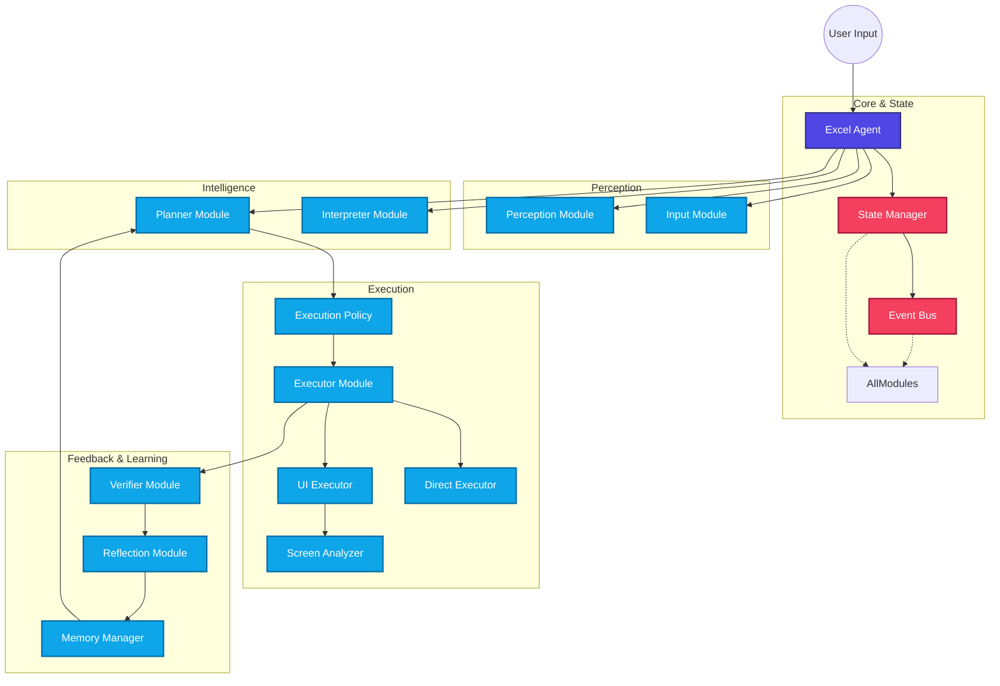
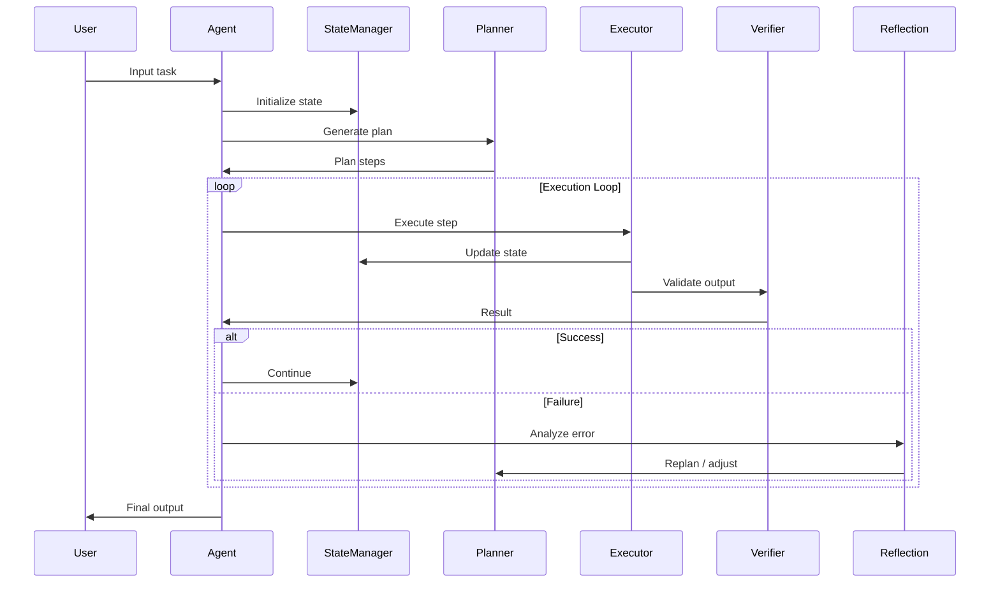
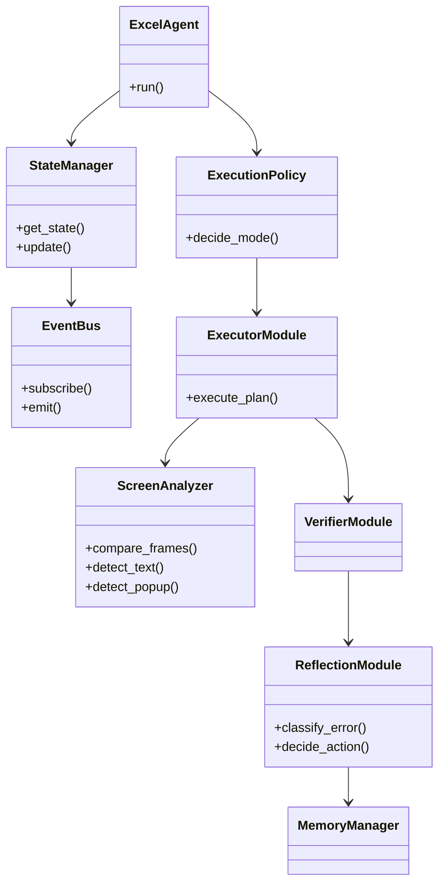

# Excel Automation Agent Architecture

This document contains a comprehensive architectural map of the entire system.

## High-Level System Architecture & Flow

## Execution Flow (Detailed)

## Module Dependency (Final)

